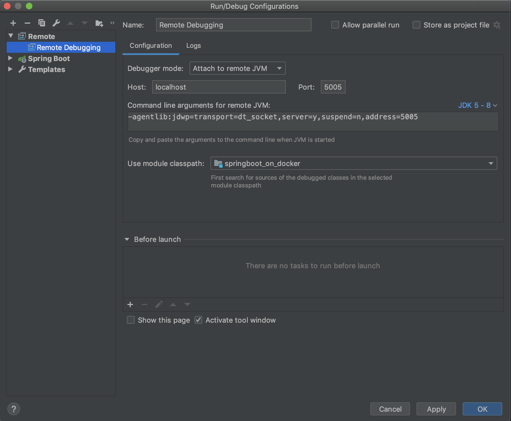

# Spring Boot on Docker

## Docker로 이미지 만들기
1. 그래들 빌드
   ```
   $ ./gradlew clean build
   ```
2. 이미지 빌드
    ```
    $ docker build --no-cache --build-arg JAR_FILE="build/libs/*.jar" -t springbootondocker:0.1 .
    ```
2. 실행
    ```
    $ docker run -d -p 8080:8080 springbootondocker:0.1
    ```
3. 접속
   ```
   $ curl http://localhost:8080
   Hello Spring Boot on docker!
   ```

## Docker로 원격 디버깅 하기
1. 그래들 빌드
   ```
   $ ./gradlew clean build
   ```
2. 이미지 빌드
    ```
    $ docker build --no-cache --build-arg JAR_FILE="build/libs/*.jar" -t springbootondocker:0.2 .
    ```
3. Edit Configurations 생성
    
4. 실행
    ```
    $ docker run -d -p 8080:8080 -p 5005:5005 springbootondocker:0.2
    ```

## Docker Compose 원격 디버깅 하기
1. 그래들 빌드
   ```
   $ ./gradlew clean build
   ```
   - 이미지 빌드는 Gradle 빌드하면 같이 진행되고 바로 컨테이너가 실행된다.
2. 서비스 재기동
   ```
   $ docker-compose restart
   ```
   - `주의사항`: MYSQL이 최초 이미지 받고 구동시 오래 걸려서 SpringBoot Container에서 MYSQL을 찾지 못한다. SpringBoot Container를 
   리스타트 해줘야 한다. (**도와주세요~~~**)
3. 접속
   ```
   $ curl http://localhost:8080/mysql
   Data is null
   ```
4. 테이블 생성 / 데이터 생성
5. 접속
   ```
   $ curl http://localhost:8080/mysql
   ```

## 참고
- [Spring boot docker](https://spring.io/guides/gs/spring-boot-docker)
- [buildpacks.io](https://buildpacks.io/docs/install-pack/#macos)
- [개발환경에서 Docker 활용](docs/ppt/개발%20환경에서%20Docker%20활용.pdf)
